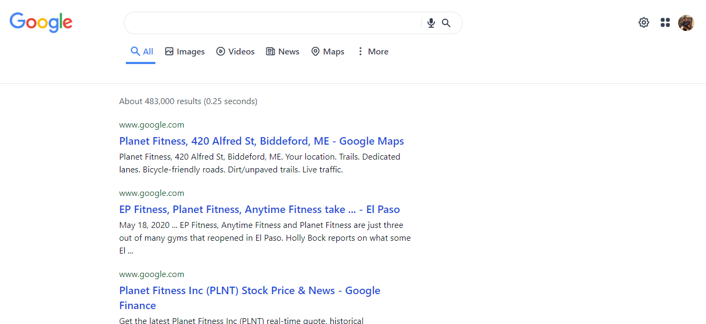

# **Next.js Typescript Google Clone**

    
    

## **About the proyect**

- This proyect was created using **Next.js** framework
- It also uses **Typescript** and **Tailwind css**
- For icons: **Hero Ioncs**
- For fetching the data it uses the **Google search API** (Take in count that the API key is limited to 100 searchs)
- This app is responsive with a minimum of **320px**
